# Navier–Stokes (FEniCSx) example

This is an **advanced** example showing how to apply the `gp_active_mcmc` workflow to a
PDE-based forward model (incompressible Navier–Stokes) on a backward-facing-step geometry.

It is **not executed** as part of the documentation build because it requires a separate
FEniCSx/DOLFINx + PETSc + MPI + Gmsh environment.

### Requirements

The Navier–Stokes example uses the FEniCS/DOLFINx ecosystem and a standard MPI toolchain.
These are typically installed via **conda-forge** (not reliably via `pip`):

- `fenics-dolfinx=0.9.0` (conda-forge, version=0.10 does not work)
- `mpich` (conda-forge)
- `gmsh=4.15.0`
- `python-gmsh=4.15.0`
- `pyvista`

A representative conda installation (adjust to your environment):

```bash
conda install -c conda-forge fenics-dolfinx=0.9.0 mpich gmsh=4.15.0 python-gmsh=4.15.0 pyvista
```

## Where to find the code

The full example lives in the repository under:

- `examples/navier-stokes/utils/` — mesh, solver, QoI extraction, animation utilities
- `examples/navier-stokes/run_forward_*.py` — build/validate a POD–GP surrogate
- `examples/navier-stokes/run_backward_*.py` — inverse problem with Active/Adaptive MCMC

Start here:

- **Forward (surrogate)**: `examples/navier-stokes/run_forward_ns_hf_surrogate.py`
- **Backward (inference)**: `examples/navier-stokes/run_backward_ns_active_mcmc.py`
- **MF/HF solver sweep**: `examples/navier-stokes/cfd/run_mf.py`

## Precomputed outputs (from the example)

The figures below are generated by running the scripts in `examples/navier-stokes/`
and are committed as static assets so they render on the hosted documentation.

### Velocity magnitude animation

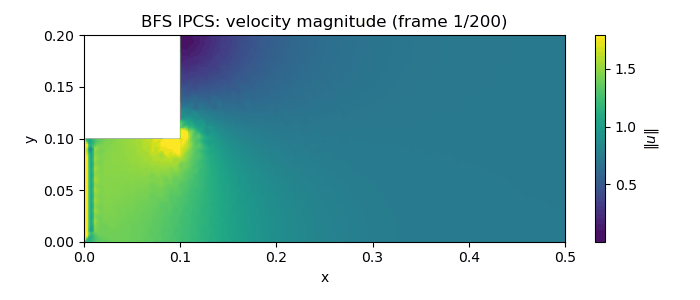

### Outlet profiles (QoI) for representative parameters

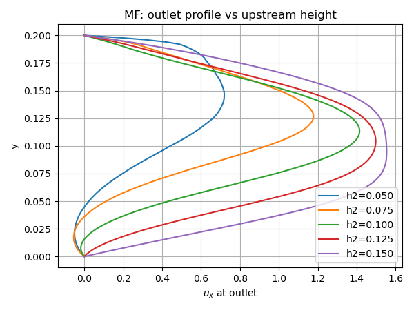
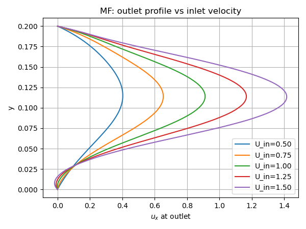

### POD energy (surrogate compression)

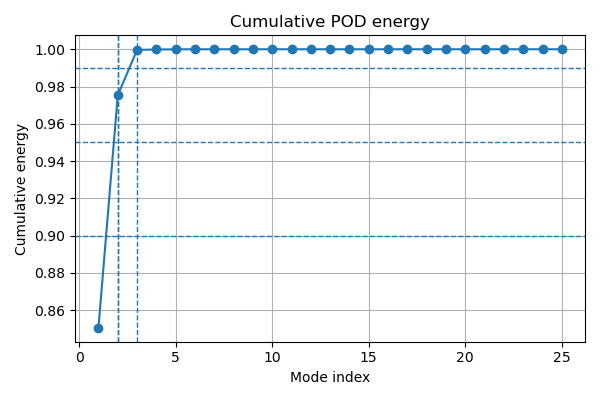

### Surrogate prediction examples (median and worst)

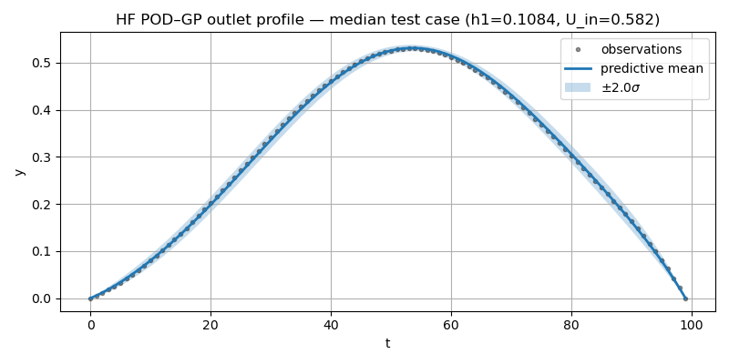
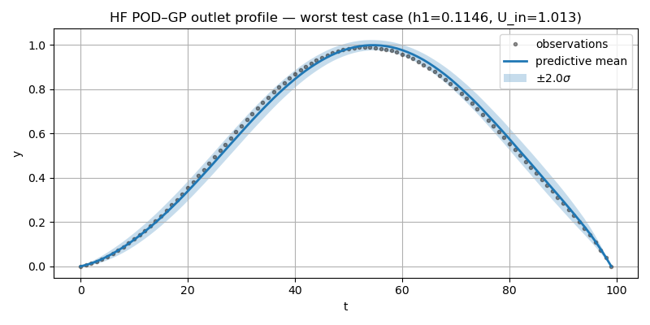

### Noisy Observation

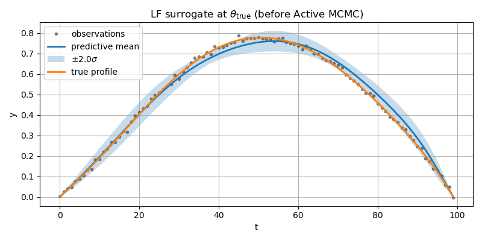

### Posterior using MCMC Active Learning

Not reliable and seed-dependent.

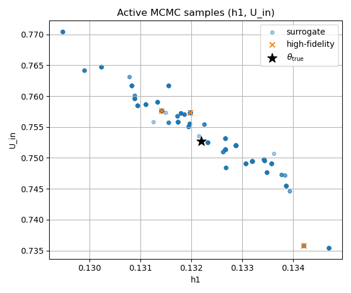
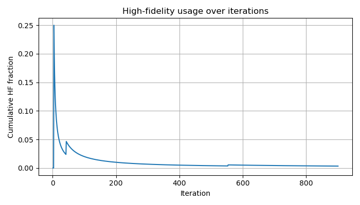
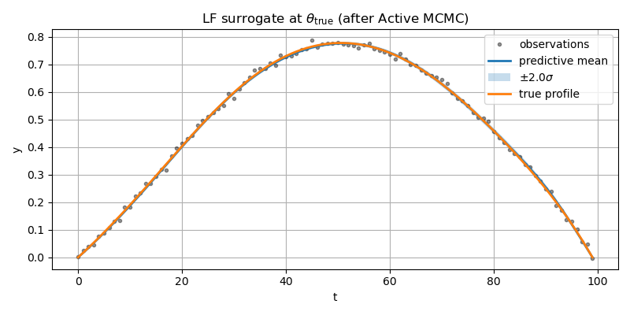

### Posterior using DA-MCMC Active Learning with Adaptive Subchain

Robust and accurate.

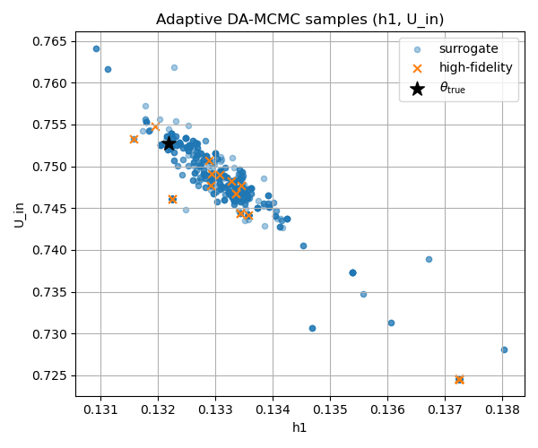
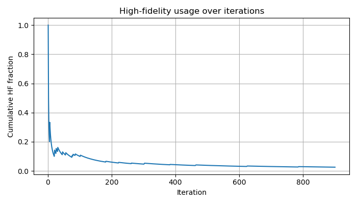
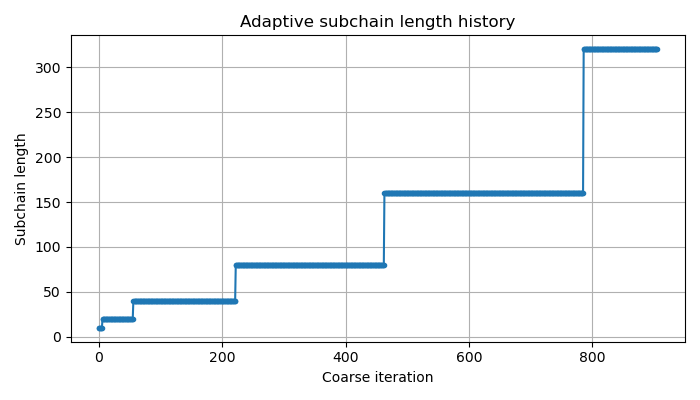


Summary

```
Active MCMC summary: {'n_steps': 901, 'n_dim': 3, 'move_fraction': 0.04666666666666667, 'hf_call_fraction': 0.003329633740288568, 'n_hf_calls': 3, 'posterior_rmse': 0.02565835473083319}

Adaptive DA-MCMC summary: {'n_steps': 900, 'n_dim': 3, 'move_fraction': 0.23804226918798665, 'hf_call_fraction': 0.025555555555555557, 'n_hf_calls': 23, 'mean_subchain_length': 129.20529801324503, 'posterior_rmse': 0.011547864268091526}
```
